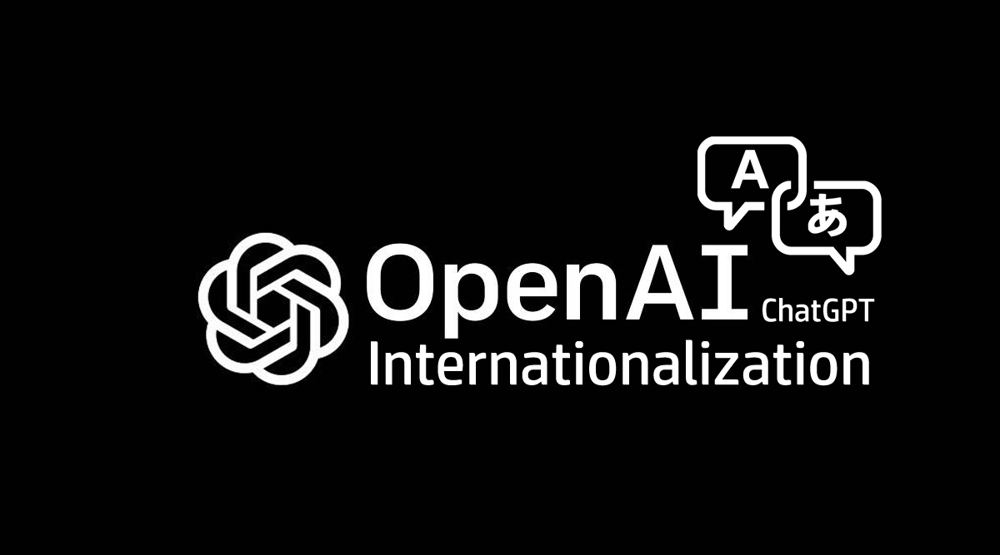
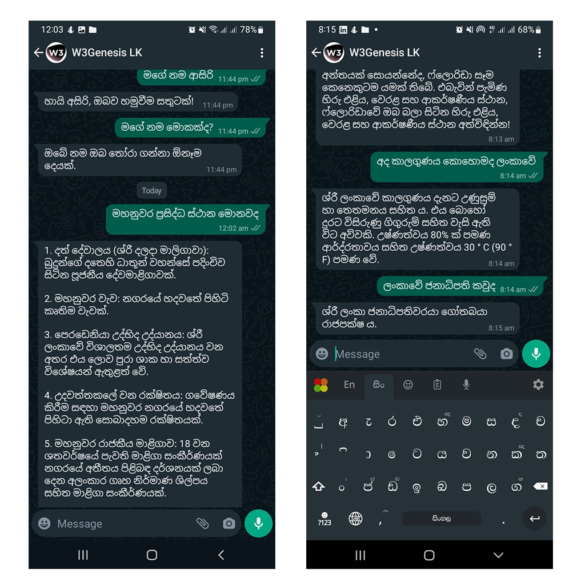

# pyChatGPT-intl


### Enhanced ChatGPT Wrapper for Internationalization - Python3
This NodeJS module acts as a wrapper for ChatGPT API and will help you to use ChatGPT in your own language.


## Installation

Install chatgpt-intl via pip : https://github.com/asirihewage/pyChatGPT-intl

```bash
 pip install chatGPT-intl
```

## Usage/Examples
First, you have to obtain your API key from OPENAI, then you can use it here.
```python
pip install chatGPT-intl
```

## API
text - Type: string (The text to be translated)

openAiKey - Type: string (API Key obtained from OpenAI Developer Account)

opts - Type: object (OpenAI Language Model and hyperparameters)

lang - Type: string ( Must be `auto` or one of the codes (not case sensitive) contained in [SUPPORTED_LANGUAGES.md](https://github.com/asirihewage/pyChatGPT-intl/blob/main/SUPPORTED_LANGUAGES.md).)

## Features

- Use ChatGPT API in your own language
- Ability to customize the chatGPT model
- Supports more than 50 languages

## Limitations

- Does not support for syntax and codes
- Does not support larger text inputs

## Language Support
Supported language codes contained in [SUPPORTED_LANGUAGES.md](https://github.com/asirihewage/pyChatGPT-intl/blob/main/SUPPORTED_LANGUAGES.md)

## Demo
```shell
python3 chatGPT-intl.py
```
Sample App I created.


## Authors

- [@asirihewage](https://github.com/asirihewage)

## Contributions

- Issues and feature updates are welcome.


## License

[MIT](https://choosealicense.com/licenses/mit/)
